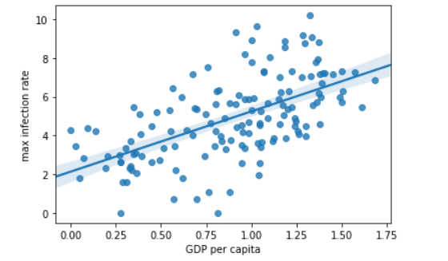

# Data-Analysis-on-COVID-19-Dataset
Preprocessing and merging of COVID-19 datasets to calculate needed measures and prepare them for an Analysis using Numpy, Pandas, Seaborn and Matplotlib under the guided project. The datasets consists of the data related to the cumulative number of confirmed cases, per day, various life factors, scored by the people living in each country around the globe & as well as the deaths reported. The result accuracy may vary due to the time gap of dataset creation and the time of release. 
EDIT: This release is a re-upload of one precious upload which was incomplete

The above graph shows Visualizing data related to a country 

